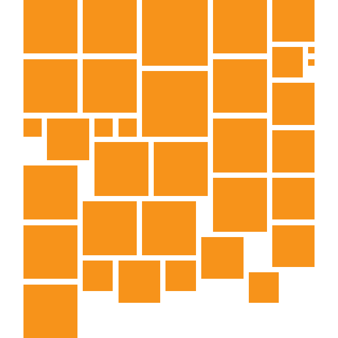
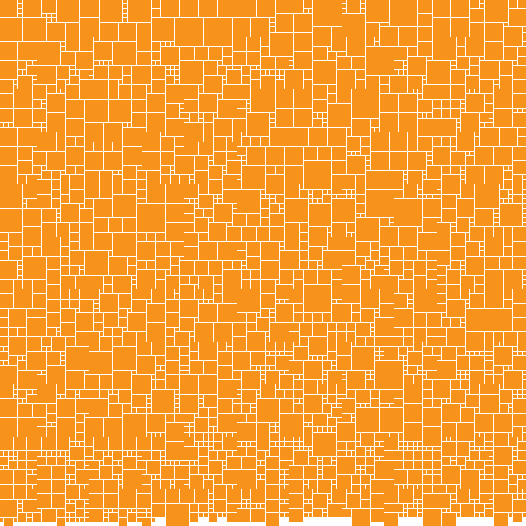
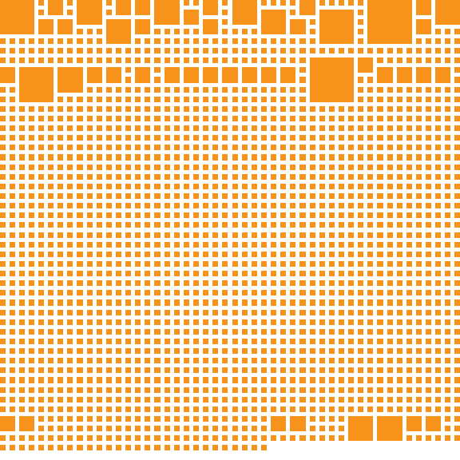

# bitmap-renderer

BTC Donations: bc1qpq6600v0kuapsasv99jr24zrjhz83qk0s7fk32

A Rust service that renders Bitcoin block bitmaps as PNG images. Given a block number, it fetches the block's transaction data from a Bitcoin Core RPC node and produces a Mondrian-style visualization where each transaction is represented as an orange square.

This renderer is **block-number native** — it takes a block height and renders it directly from on-chain transaction data. It doesn't know or care about inscription IDs, ordinal theory, or which bitmap is inscribed to which block. If you have a block number, you get an image.

## Examples

These are actual outputs from the renderer, verified against Magic Eden's reference images.

**1-tx blocks** — single coinbase transaction fills the entire image:

| Block 2 (Letters 1) | Block 84534 (Wide Neck Punk, 2 txs) |
|---|---|
|  |  |

**Punk blocks** — rare low-tx blocks with distinctive layouts:

| Block 78319 (Pristine Punk, 2 txs) | Block 75546 (5tx Punk, 5 txs) | Block 127332 (Grid Punk, 22 txs) |
|---|---|---|
|  |  |  |

**Medium and large blocks** — increasingly dense Mondrian packing:

| Block 163284 (34 txs) | Block 677633 (2177 txs) | Block 802383 (1966 txs) |
|---|---|---|
|  |  |  |

## How it works

Each transaction in a block becomes an orange square sized by its total output value on a log10 scale:

```
size = ceil(log10(total_sats)) - 5, minimum 1
```

A 1 BTC transaction (1e8 sats) gets size 3. A 50 BTC coinbase gets size 5. A 100k sat tx gets size 1.

Squares are packed into a grid using a **Mondrian bin-packing** algorithm (ported from [bitfeed](https://github.com/bitfeed-project/bitfeed)). The grid width is computed as `ceil(sqrt(total_area))` where total_area is the sum of all squared tx sizes.

### Rendering formula

The grid scales to fill a 576x576 image. After laying out squares, the renderer measures the actual content extent and computes:

```
max_extent  = max(content_width, content_height)
gridSize    = 576 / (max_extent - 0.5)
unitPadding = gridSize / 4
```

Content is centered in both axes. Each square is drawn at:

```
x0 = floor(offset_x + col * gridSize)
y0 = floor(offset_y + row * gridSize)
x1 = ceil(offset_x + (col + size) * gridSize - 2 * unitPadding)
y1 = ceil(offset_y + (row + size) * gridSize - 2 * unitPadding)
```

This means small blocks (few transactions) produce large squares that fill the image, while large blocks pack many small squares tightly. The color is always Bitcoin orange `#F7931A` on a white background.

## Usage

### Running the server

```bash
# With a local Bitcoin Core node (default: localhost:8332)
BTC_RPC_USER=your_user BTC_RPC_PASS=your_pass cargo run

# Custom RPC endpoint and port
BTC_RPC_URL=http://node:8332 BTC_RPC_USER=user BTC_RPC_PASS=pass PORT=8080 cargo run
```

### Requesting images

```
GET /{block_number}.png
```

```bash
# Block 0 (genesis)
curl -o genesis.png http://localhost:3080/0.png

# Block 163284
curl -o 163284.png http://localhost:3080/163284.png

# Block 800000
curl -o 800000.png http://localhost:3080/800000.png
```

Responses include `Cache-Control: public, max-age=31536000, immutable` since block data never changes.

### As a library

The rendering logic is also exposed as a library crate:

```rust
use bitmap_renderer::{Block, render_bitmap};

let block: Block = serde_json::from_str(&block_json)?;
let png_bytes: Vec<u8> = render_bitmap(&block);
```

The `Block` struct expects the shape returned by Bitcoin Core's `getblock` RPC (verbosity 2) — specifically `tx[].vout[].value`.

## Building

```bash
cargo build --release
```

## Testing

The test suite compares rendered output against reference images from Magic Eden's bitmap renderer. Each test measures three metrics:

- **Spatial similarity** — the image is divided into a 32x32 grid and each cell is compared for orange coverage. A cell matches if the coverage difference is < 0.3. Score = matching cells / 1024.
- **Coverage ratio** — the ratio of total orange-filled cells between our output and the reference. Catches overall density differences.
- **Pixel IoU** — intersection over union of orange pixels. The strictest metric: counts every pixel that differs between our output and the reference.

```bash
cargo test
```

### Test coverage by bitmap trait

The test suite covers **14 blocks** spanning every bitmap trait type, from 1-tx genesis-era blocks to 2600+ tx modern blocks. 7 blocks are pixel-perfect (100% IoU). All 14 are above 95% pixel IoU.

| Block | Txs | Trait | Spatial | Coverage | Pixel IoU |
|-------|-----|-------|---------|----------|-----------|
| 2 | 1 | Letters 1 (1-digit) | 100% | 1.00 | 100% |
| 340 | 1 | Letters 3 (3-digit) | 100% | 1.00 | 100% |
| 8112 | 1 | Patoshi | 100% | 1.00 | 100% |
| 57019 | 1 | Pizza Day | 100% | 1.00 | 100% |
| 75546 | 5 | 5tx Punk | 100% | 1.00 | 99.4% |
| 78319 | 2 | Pristine Punk | 100% | 1.00 | 100% |
| 84534 | 2 | Wide Neck Punk | 100% | 1.00 | 100% |
| 127332 | 22 | Grid Punk | 100% | 1.00 | 99.0% |
| 699412 | 7 | Community Punks | 100% | 1.00 | 100% |
| 163284 | 34 | — | 100% | 0.97 | 99.5% |
| 258502 | 128 | — | 100% | 1.00 | 99.97% |
| 474712 | 2620 | Range 400k | 100% | 1.00 | 99.0% |
| 677633 | 2177 | — | 100% | 0.99 | 95.5% |
| 802383 | 1966 | Range 800k | 100% | 0.89 | 97.3% |

Thresholds are set to the exact current scores so any regression is caught immediately.

### Adding test cases

```bash
# Download a reference image and block fixture
./tests/add_test.sh <block_number> <inscription_id>

# Then add to tests/regression.rs:
#[test]
fn block_NNNNNN() { assert_block_matches(NNNNNN, 0.98, 0.95); }
```

Test output images are saved to `tests/output/` for visual inspection when a test fails.

## Environment variables

| Variable | Default | Description |
|----------|---------|-------------|
| `BTC_RPC_URL` | `http://localhost:8332` | Bitcoin Core RPC endpoint |
| `BTC_RPC_USER` | `bitcoin` | RPC username |
| `BTC_RPC_PASS` | `bitcoin` | RPC password |
| `PORT` | `3080` | HTTP server port |
